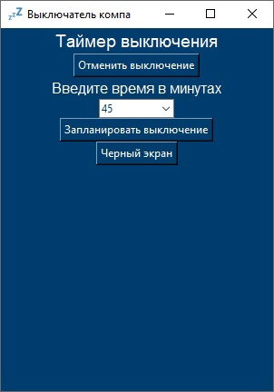

# 🕒 PC Sleep - Таймер выключения компьютера


Маленькое и простое приложение для планирования выключения компьютера через заданное время. Идеально подходит для тех, кто любит засыпать под сериалы или хочет автоматизировать завершение работы ПК.

✨ **Особенности**:
- Простое управление в один клик
- Настраиваемый таймер (от 1 до 90 минут)
- Возможность отменить выключение
- Режим "Черный экран" (для кинотеатра или сна)
- Симпатичный синий интерфейс

## 🖼️ Скриншот


[//]: # (## ⚙️ Установка)

[//]: # (1. Скачайте последнюю версию из [раздела Releases]&#40;https://github.com/ваш-username/ваш-репозиторий/releases&#41;)

[//]: # (2. Запустите `PC_Sleepy_Time.exe`)

Соберите из исходников:
```bash
pip install pyinstaller
pyinstaller --onedir main.py --noconsole --icon favicon.ico